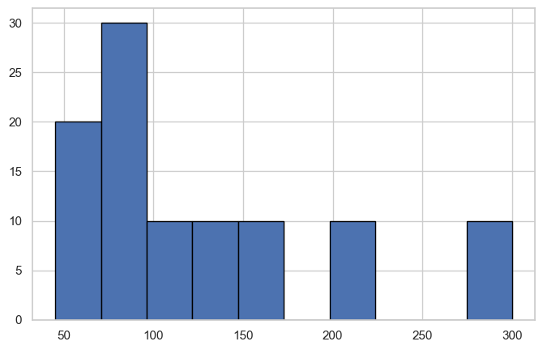
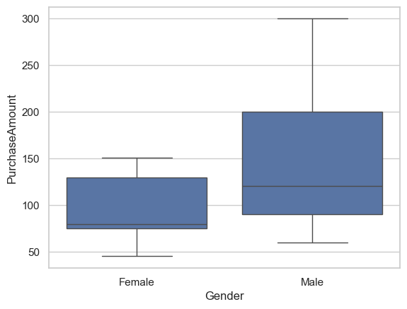
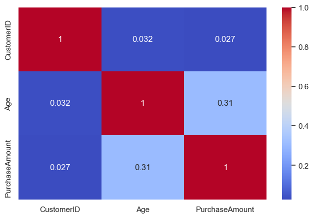
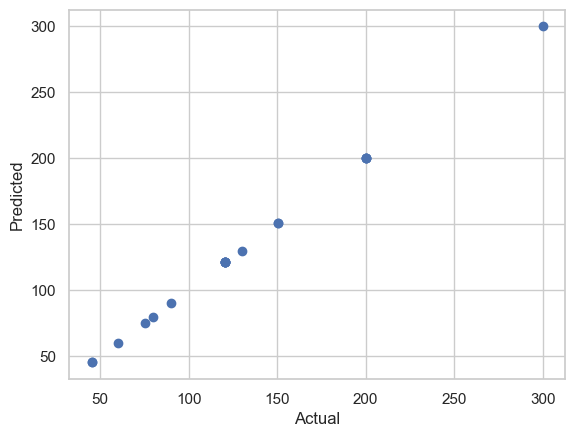

# AI-Driven Customer Purchase Behavior Analysis

## Overview
This project analyzes customer demographic and purchase behavior data to identify patterns that influence spending and support better business decision-making.

## Tools Used
- Python
- Pandas
- NumPy
- Matplotlib
- Seaborn
- Jupyter Notebook
- Exploratory Data Analysis (EDA)

## Project Scope
This project combines multiple stages of analysis, including problem framing, dataset evaluation, exploratory data analysis, and final business insights.

## Key Visualizations

### Purchase Distribution

### Gender vs Purchase Amount

### Correlation Heatmap

### Actual vs Predicted (Model Output)

## Key Insights

- Product category has a significant impact on purchase amount, with Electronics and Home categories showing higher spending patterns  
- Customer demographics such as age and gender show moderate influence but are not the primary drivers of purchase behavior  
- Purchase amount distribution indicates the presence of both low and high-value customers  
- Correlation analysis suggests limited strong relationships between numerical variables, highlighting the importance of categorical features  
- The dataset shows strong potential for predictive modeling and customer segmentation

## Business Insights & Recommendations

The analysis suggests that product category plays a more important role in customer spending compared to demographic attributes.

Customers purchasing Electronics and Home products tend to generate higher revenue, indicating that businesses should focus marketing and promotional strategies on these categories.

While demographic features provide some segmentation value, behavior-based targeting is more effective for improving customer engagement and revenue.

### Recommendations

- Focus marketing efforts on high-value product categories  
- Use purchase behavior for customer segmentation  
- Apply predictive models to forecast customer spending  
- Enhance personalization strategies based on customer purchase patterns  

## Conclusion

This project demonstrates a complete data analysis workflow, including preprocessing, exploratory analysis, multivariate analysis, and introductory modeling.

The findings provide actionable business insights and establish a strong foundation for future machine learning applications such as purchase prediction and customer segmentation.